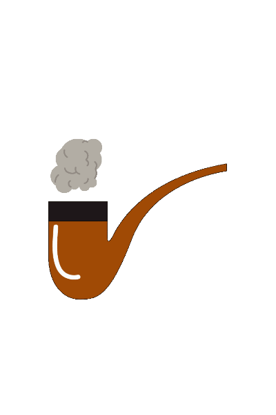

class: inverse, center, middle


```{r setup, include=FALSE}
options(htmltools.dir.version = FALSE)
knitr::opts_chunk$set(
  fig.width=9, fig.height=3.5, fig.retina=3,
  out.width = "100%",
  cache = FALSE,
  echo = TRUE,
  message = FALSE, 
  warning = FALSE,
  hiline = TRUE
)
```

```{r xaringan-themer, include=FALSE, warning=FALSE}
library(xaringanthemer)
style_duo_accent(
  primary_color = "#04151f",
  secondary_color = "#08a4bd",
  inverse_header_color = "white",
  background_color = "rgb(211,211,211)",
  header_font_google = google_font("Josefin Sans"),
  text_font_google   = google_font("Montserrat", "300", "300i"),
  code_font_google   = google_font("Fira Mono"),
  title_slide_background_image = "../images/bear.png",
  title_slide_background_color = "#734b5e",
  title_slide_text_color = "white",
  link_color = "darkblue",
  text_font_size = "1.5em"
)
```

```{r xaringan-logo, echo=FALSE}
xaringanExtra::use_logo(
  image_url = "../images/DTA_logo.png", height = "80px"
)

xaringanExtra::use_tile_view()
```


# What the tidyverse is about

---

## Pipes and consistency

.pull-left[We've discussed piped coding style [elsewhere](https://wordsmith189.github.io/intro-to-tidyverse/introduction_to_the_tidyverse.html#1).

The idea of consistency revolves around the arguments that functions expect. When coding with pipes, it is hugely preferable if all functions expect the **data object as first argument**.

That is the case with `mutate(), select()`, and `filter()`.

]

.pull-right[]

---
class: right
background-image: url(../images/mutant.png)
background-size: cover

<br /><br />
### mutate()
creates new columns

--
### select()
subsets datasets by column<br />using *identifiers*

--
### filter()
subsets datasets by row<br />using *conditions*


---


